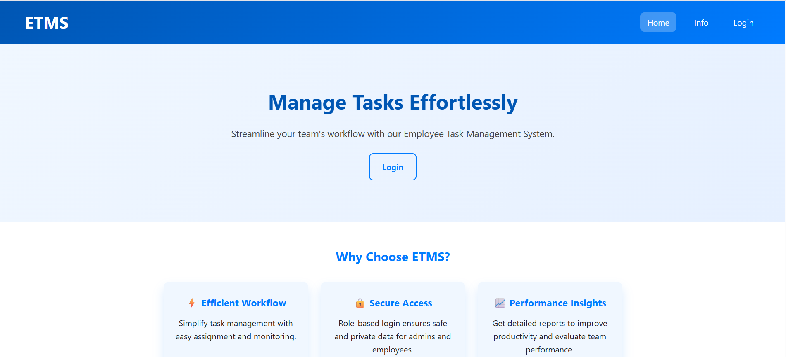
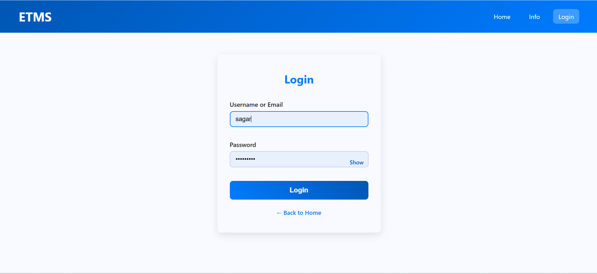
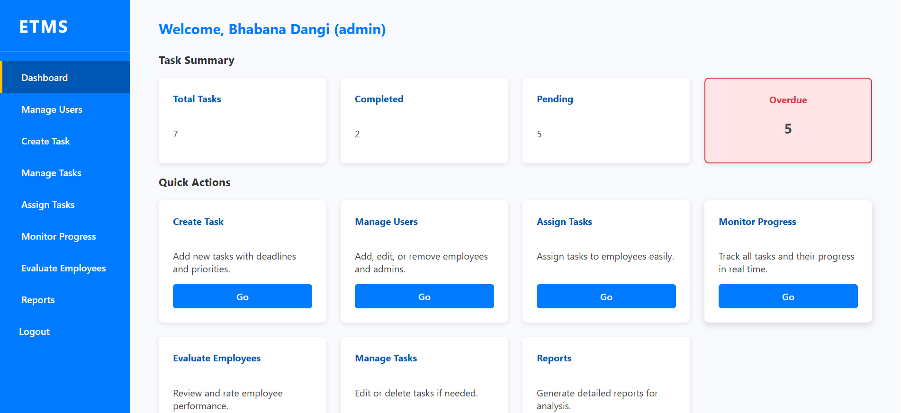
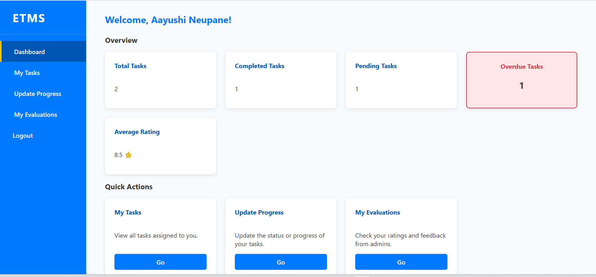
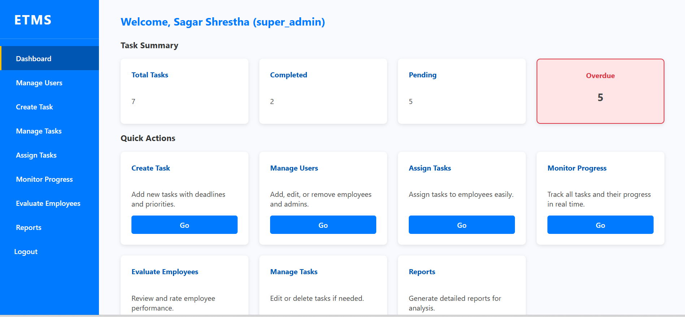
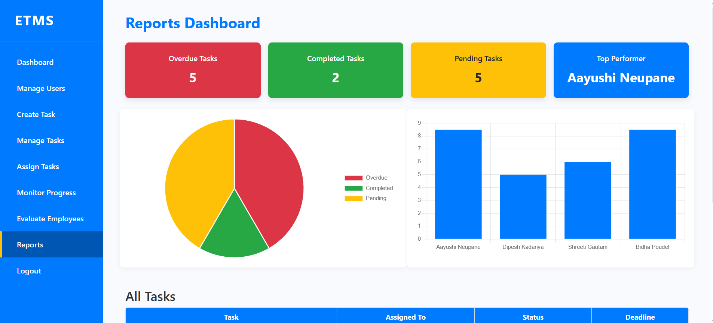

# Employee Task Management System (ETMS)

## Overview
This is a web-based Employee Task Management System developed using PHP and MySQL. The system allows admins to manage employees and assign tasks, while employees can view and update their tasks.

## Features
- Admin login system
- Employee login system
- Task creation and assignment
- Task tracking system
- Role-based dashboards
- Employee performance evaluation
- Report generation
- Search and manage employees

## Technologies Used
- PHP
- MySQL
- HTML
- CSS
- JavaScript
- XAMPP (Apache + MySQL)

## Database Setup
1. Start XAMPP (Apache + MySQL)
2. Open phpMyAdmin
3. Import `etms.sql`
4. Update `db.php` if needed

## How to Run
1. Copy project folder to:
   `C:\xampp\htdocs\etms`
2. Start XAMPP server
3. Open browser:
   `http://localhost/etms/`

## Screenshots

### Home Page

### Login Page

### Admin Dashboard

### Employee Dashboard

### Super Admin Dashboard

### Reports Page

## Author
BIM Undergraduate Student, Nepal
